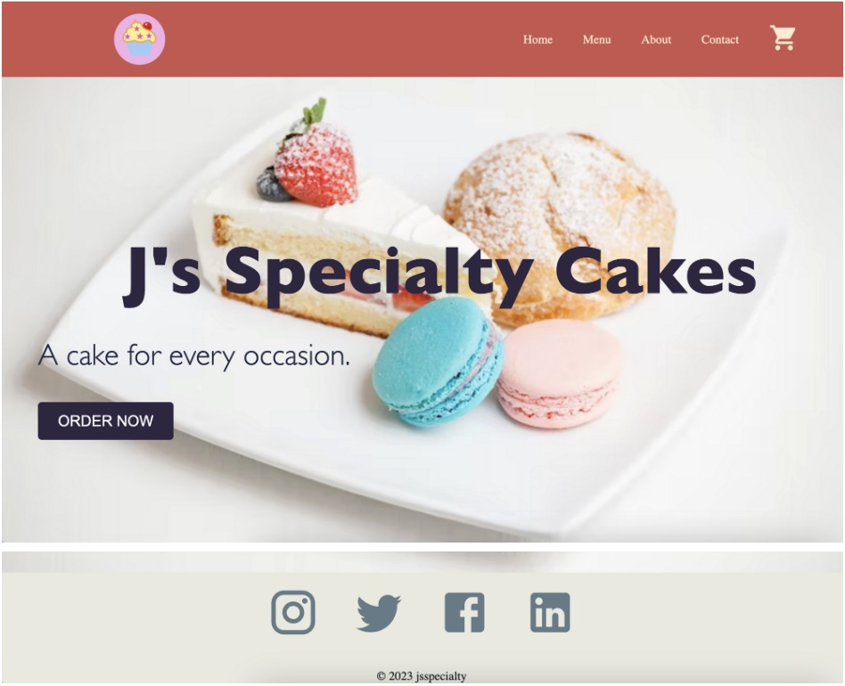
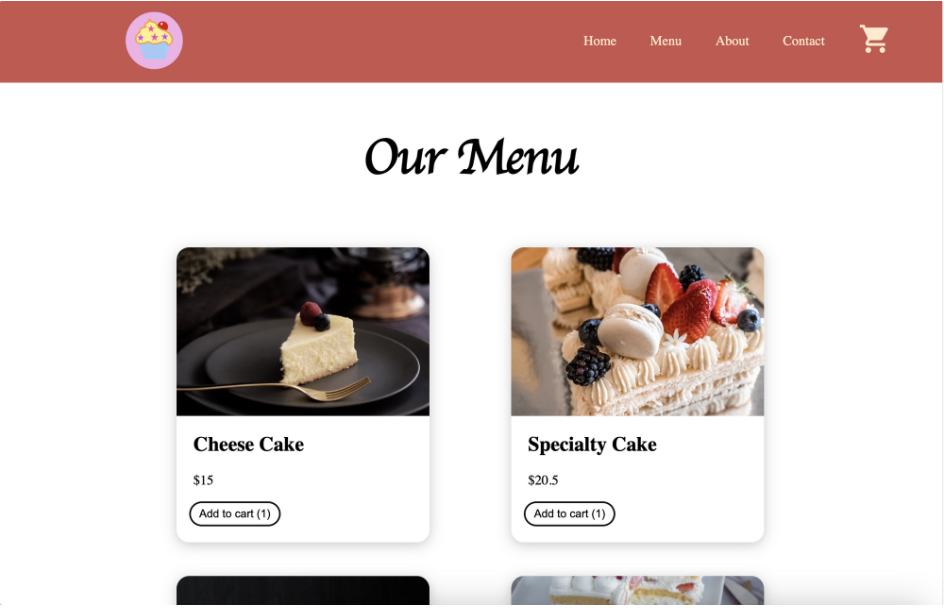
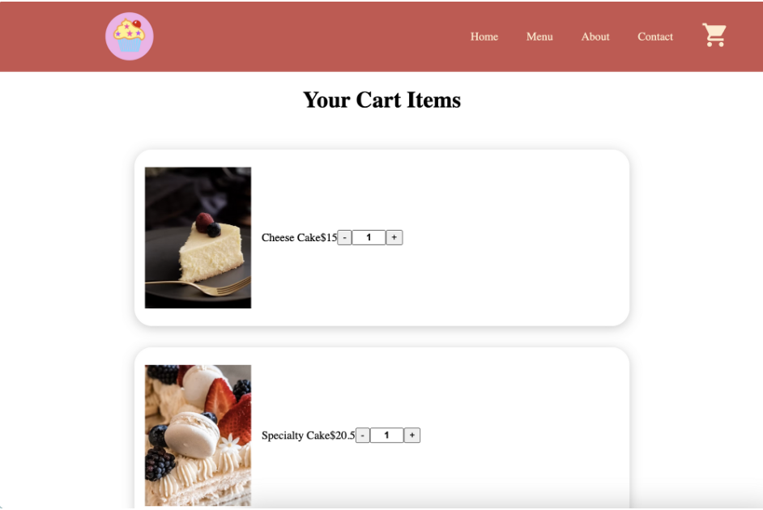
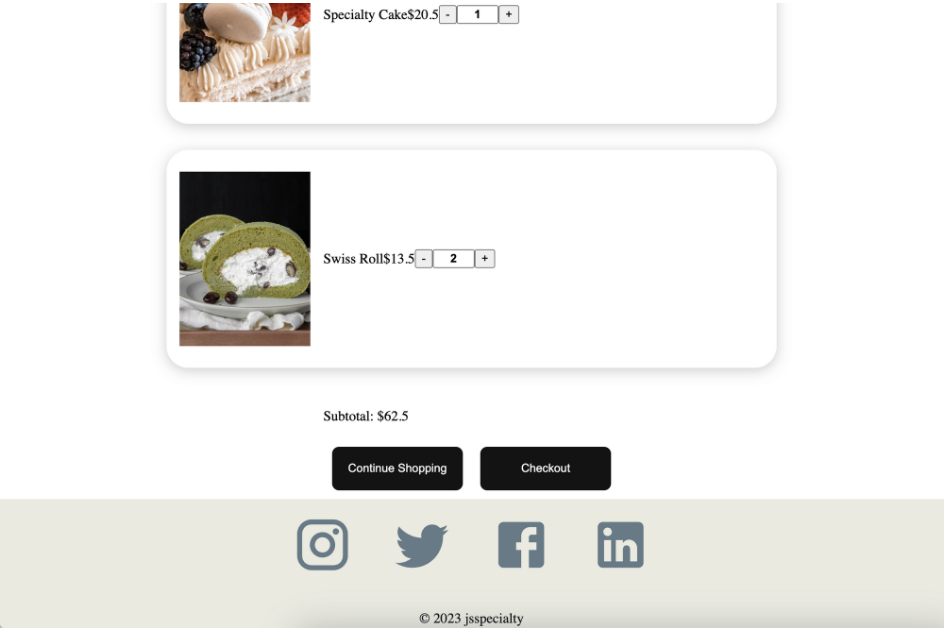
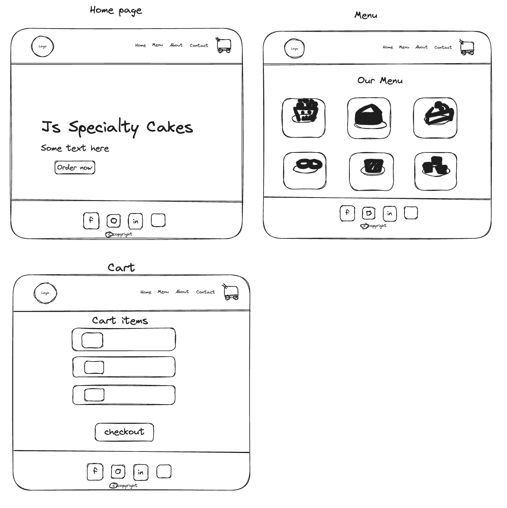

# js-specialty-cakes
Js specialty cakes app is a platform that enables users to browse and order cakes for various occasions through an online interface. The app provides a convenient way for customers to explore a selection of cake options.
## :computer: [Click here](https://js-specialty-cakes.surge.sh) to see my live project!

## :page_facing_up: User Story
- As a cake enthusiast, the user wants to explore a variety of delicious cakes and make a purchase through an intuitive app interface. So that the user can easily navigate and interact with the available options.
- Features:

1. When opening the app, the user should be greeted with a visually appealing interface.
2. When the page width shrinks to less than 600px, the navigation bar becomes responsive, disappearing and displaying a hamburger icon instead.
3. The app should display images and descriptive text for each available cake.
4. The user should be able to add cakes to a mock cart by clicking an "Add to Cart" button
5. The app should keep track of the total price as the user adds cakes to the cart.
6. The user should be able to view the contents of the mock cart and see the total price calculated.
7. The app should provide a user-friendly way to modify the quantity of cakes in the cart or remove them completely.

- This is how the Js specialty cakes app looks:

## :pencil2: Planning & Problem Solving
- 

- 

## :rocket: Tech 
- Coding languages: JavaScript, CSS
- Framework: React
- Libraries: Materials UI/Icons
- Deployment: Surge
- Code editor: Visual Studio Code.

## :scream: Bugs to fix :poop:
- When the page width shrinks to less than 600px, the navigation bar becomes responsive, disappearing and displaying a hamburger icon instead. If the hamburger icon is clicked, the navigation bar will reappear, while the cake logo disappears, as designed. However, if the page width is then increased beyond 600px, two navigation bars will be displayed.

- 

## :white_check_mark: Future features
- Contact page update
- User login functionality